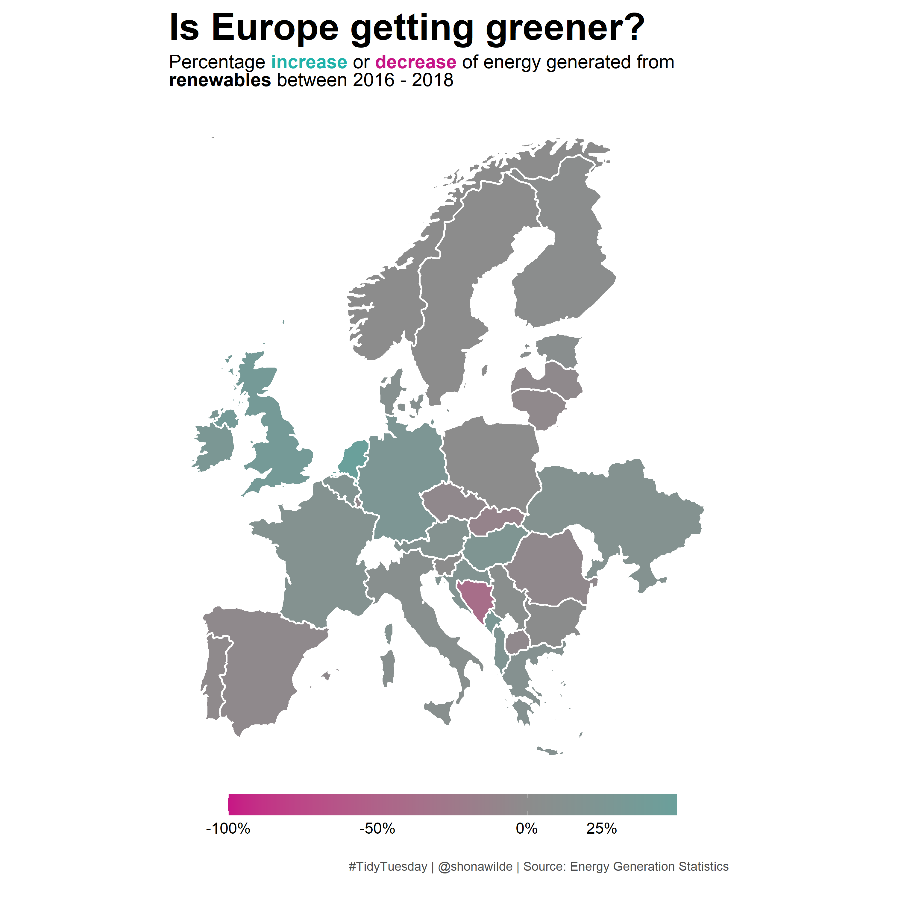
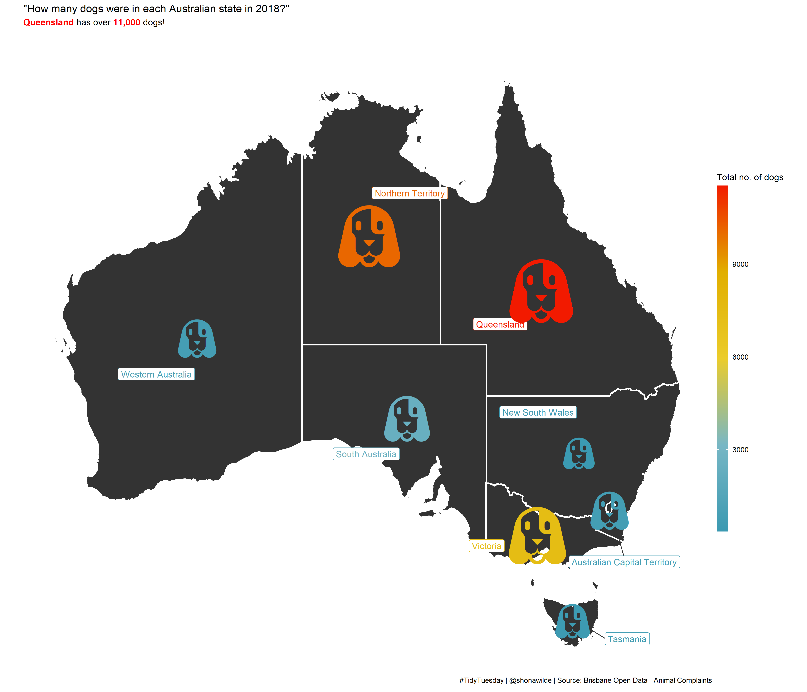

```{r setup, include=FALSE}
knitr::opts_chunk$set(echo = F)
```

Click on the relevant plot for code.

## Week 32 (August 2020) - European Energy Production

<a href='scripts/tt_week32_energy_production.R' target='_blank'></a>


## Week 30 (July 2020) - Australian Animals and Pets

<a href='scripts/tt_week30_animals.R' target='_blank'></a>


